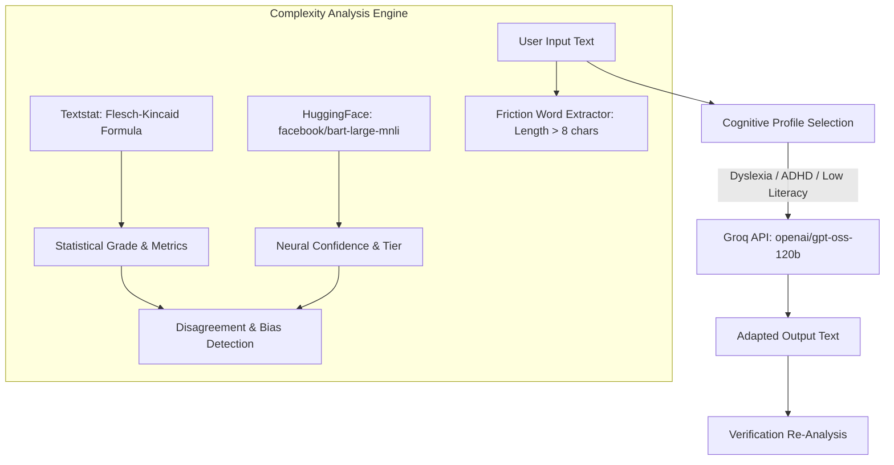

# ReadableAI 🧠

[](https://readapt-app.streamlit.app/)
[](https://www.python.org/)
[](https://huggingface.co/facebook/bart-large-mnli)
[](https://groq.com/)

> **An accessibility-first AI platform that evaluates text complexity through dual statistical and neural lenses, surfaces algorithmic assumptions, and adapts content for neurodivergent readers.**

🔗 **Live Demo:** [readapt-app.streamlit.app](https://readapt-app.streamlit.app/)

---

## 💡 The Core Problem

Most AI systems and readability metrics implicitly encode assumptions about who the "standard" reader is. These assumptions—baked into training corpora, readability formulas, and downstream language models—systematically disadvantage readers with **dyslexia**, **ADHD**, or **low literacy**.

Traditional readability indices measure structural proxies like syllable counts and sentence length. Transformer models measure semantic predictability and contextual familiarity. Neither captures what actually creates cognitive friction for an individual reader.

**ReadableAI** makes these latent assumptions visible. By contrasting historical statistical heuristics with modern zero-shot transformers, it exposes where AI models disagree on "difficulty" and provides targeted, cognitive-profile-aware simplification.

```
"Difficulty is not an intrinsic property of text alone; 
 it is a relationship between text and the cognitive architecture of the reader."
```

---

## ✨ Features

- **Dual-Engine Complexity Analysis**:
  - **Statistical Heuristics (1940s)**: Flesch-Kincaid Grade Level based on sentence length and syllable density via `textstat`.
  - **Zero-Shot Neural Classification (Modern)**: Transformer inference using `facebook/bart-large-mnli` across semantic complexity tiers (*Simple*, *Intermediate*, *Complex*).
- **Algorithmic Disagreement Detection**:
  - Highlights divergence between statistical and transformer predictions, exposing how different computational definitions of complexity yield contradictory conclusions.
- **Targeted Neurodivergent Adaptation (via Groq / `openai/gpt-oss-120b`)**:
  - 📖 **Dyslexia-Friendly**: Max 12 words per sentence, high-frequency vocabulary, chunked layout, and zero double negatives.
  - ⚡ **ADHD-Friendly**: Bottom-Line-Up-Front (BLUF) formatting, bulleted hierarchy, active voice, and minimal filler.
  - 🧩 **Low Literacy**: Plain English (~10-year-old vocabulary), atomic one-idea-per-sentence structure, and jargon disambiguation.
- **Cognitive Friction Highlighting**:
  - Identifies polysyllabic and lengthy words (>8 characters) that trigger visual crowding or working memory strain.
- **Closed-Loop Verification**:
  - Immediately re-evaluates simplified text through the classifier pipeline to quantitatively verify grade-level reduction.

---

## 🏗️ Architecture & Workflow



---

## 🔬 Key HAI Insights (Human-AI Interaction)

1. **When Models Disagree**:
   - A short sentence filled with high-abstraction technical jargon (e.g., *"Stochastic tensors backpropagate errors"*) might receive an elementary Flesch-Kincaid grade due to low sentence length, while BART flags it as highly complex.
   - Conversely, a rhythmic, descriptive narrative with multi-clause phrasing gets penalized by statistical formulas despite being effortless for many human readers.
2. **The "Median Reader" Fallacy**:
   - Default LLM summarizers collapse text toward an "average" reader—typically an educated, neurotypical, native English speaker.
   - Without explicit cognitive scaffolding, "simplified" AI text often substitutes complex phrasing with subtly exclusionary idiom or idioms that disorient readers with processing differences.

---

## 🛠️ Tech Stack

| Component | Technology | Purpose |
|---|---|---|
| **Interface** | [Streamlit](https://streamlit.io/) | Interactive, accessible web interface |
| **Neural Classification** | [Hugging Face Transformers](https://huggingface.co/facebook/bart-large-mnli) | Zero-shot classification (`facebook/bart-large-mnli`) |
| **Statistical Analysis** | [Textstat](https://github.com/textstat/textstat) | Flesch-Kincaid grade calculation & sentence metrics |
| **Generative Adaptation** | [Groq SDK](https://groq.com/) + `openai/gpt-oss-120b` | High-throughput, profile-tailored rewriting |
| **Runtime** | Python 3.11 + PyTorch | Execution & tensor inference |

---

## 🚀 Getting Started

### Prerequisites

- **Python 3.11+** installed
- A **Groq API Key** (obtainable for free at [console.groq.com](https://console.groq.com/))

### Installation

1. **Clone the repository:**
   ```bash
   git clone git@github.com:bidhan-skybase/Readable-AI.git
   cd Readable-AI
   ```

2. **Create and activate a virtual environment:**
   ```bash
   python -m venv venv
   source venv/bin/activate  # On Windows: venv\Scripts\activate
   ```

3. **Install dependencies:**
   ```bash
   pip install -r requirements.txt
   ```

4. **Set your Groq API key:**
   ```bash
   export GROQ_API_KEY="your-groq-api-key"
   # On Windows (cmd): set GROQ_API_KEY=your-groq-api-key
   # On Windows (PowerShell): $env:GROQ_API_KEY="your-groq-api-key"
   ```

5. **Launch the application:**
   ```bash
   streamlit run app.py
   ```
   The application will start at `http://localhost:8501`.

---

## 📁 Repository Structure

```
├── app.py              # Streamlit frontend & application orchestration
├── classifier.py       # Dual-engine analysis (Flesch-Kincaid + BART zero-shot)
├── simplifier.py       # Profile-based prompt templates & Groq LLaMA-3.3 integration
├── test_ai.py          # Quick verification script for pipeline inference
├── requirements.txt    # Project dependencies
└── readme.md           # Documentation & research overview
```

---

## ⚖️ Ethical Considerations

- **Assistive, Not Authoritative**: AI rewriting is an assistive aid, not an editorial replacement. Human-in-the-loop review is strongly advised for high-stakes text (medical instructions, legal notices, academic courseware).
- **Continual Diversity**: Cognitive profiles are not monoliths. What aids one reader with dyslexia may vary based on font rendering, visual spacing, and phonological processing habits.

---

## 👤 Author

**Bidhan Marasine**  
- GitHub: [@bidhan-skybase](https://github.com/bidhan-skybase)  
- Live Project: [readapt-app.streamlit.app](https://readapt-app.streamlit.app/)
